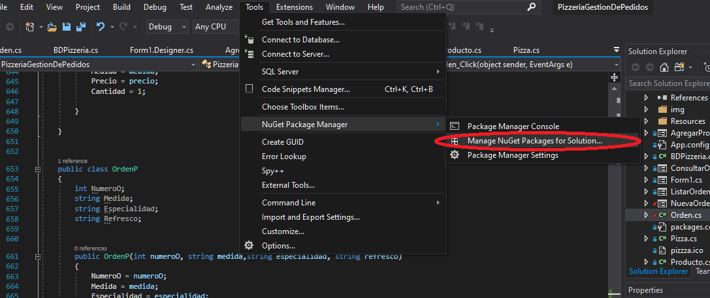
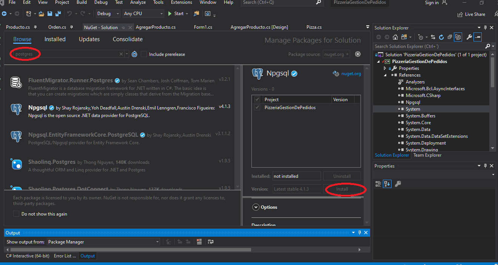
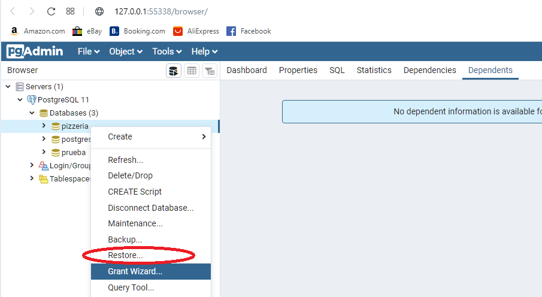
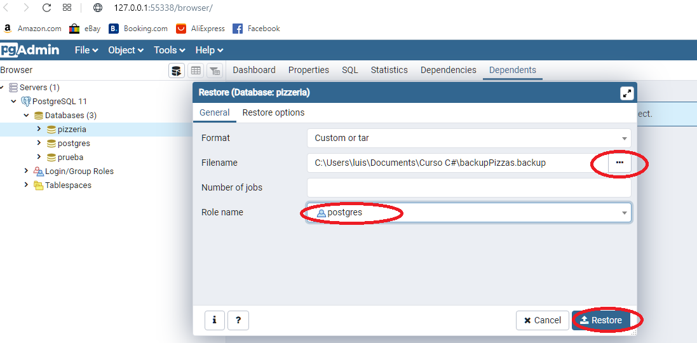

# ProyectoCSharpPizzeria
Proyecto de gestión de pedidos de una pizzería

## Autores:
- Luis David Barragán Ramírez
- Oscar Ignacio Vásquez
- Damian Matuz Cristino

## Introducción

## IMPORTANTE

Antes de ejecutar el proyecto en Visual Studio se debe de realizar las siguientes
instrucciones:

Instalar postgresql 11.7:
	https://www.enterprisedb.com/thank-you-downloading-postgresql?anid=1257367
El usuario que debe tener la base de datos es "postgres", la contraseña debe ser "hola123.,"
 y el puerto de la base de datos es el default 5432.

Una vez que ya tenemos instalada la base de datos postgresql, iremos a nuestro proyecto
en Visual Studio e iremos a esta ruta Tools->NuGet Package Manage->Manage NuGet Packages for solutios...
 así como se muestra en la siguiente imagen:

Despues debemos escribir postgres y seleccionar el driver Npgsql y lo instalamos,
la siguiente imagen ilustra lo anterior:

Ahora necesitamos importar la base de datos pizzeria, para esto
es necesario abrir PGAdmin y crear una base de datos con el nombre "pizzeria",
seleccionamos nuestra nueva base de datos, le damos click derecho y seleccionamos
restor, así como se muestra en la siguiente imagen:

Tendremos que seleccionar el archivo backupPizzas.backup y selecionar el rol postgres,
así como se muestra en la siguiente imagen:

